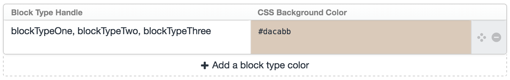

Matrix Colors plugin for Craft CMS
==================================

Easily identify your matrix blocks, by assigning a different color for each block type...

After you've installed the plugin, go to:

- Settings > Plugins > Matrix Colors

Enter your **matrix block type handle** and the **CSS color**. Any CSS color format is valid! If you're using a hex code, be sure to include the "#" prefix.

Rinse & repeat for every block type which you'd like to assign a color to.

**New in v1.1.2** - You can assign the same color to multiple block types using the same definition, by separating them with a comma.

