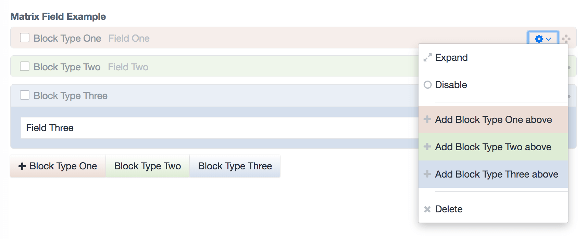
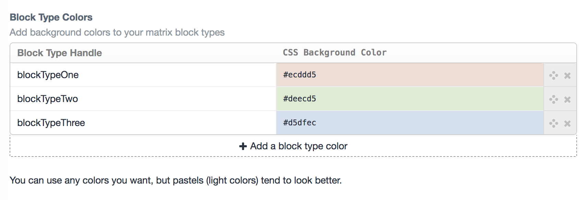
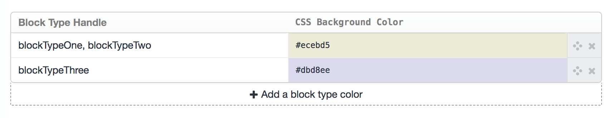

Matrix Colors plugin for Craft CMS
==================================

Identify your matrix blocks by giving each type a different color.

After you've installed the plugin, go to:

- **Settings > Plugins > Matrix Colors**

Enter your **matrix block type handle** and the **CSS color**. Any CSS color format is valid! If you're using a hex code, be sure to include the "#" prefix.

Rinse & repeat for every block type which you'd like to assign a color to.

You can assign the same color to multiple block types by separating them with a comma.

***

## Anything else?

We've got other plugins too!

Check out the full catalog at [doublesecretagency.com/plugins](https://www.doublesecretagency.com/plugins)
