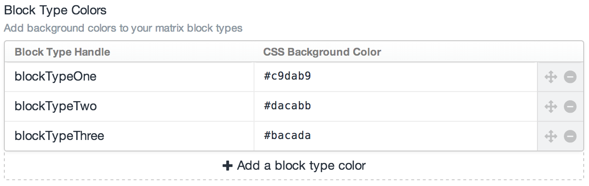
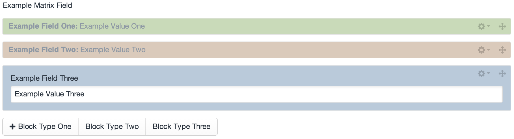

Matrix Colors
=============

Once you've installed the plugin, go to:

- Settings > Plugins > Matrix Colors

Enter your **matrix block type handle** and the **CSS color**. Remember, any CSS color format is valid... So if you're using a hex code, be sure to include the "#" prefix!

Rinse & repeat for every block type which you'd like to assign a color to. Then save.

That's it! Your matrix blocks will now be much easier to identify!

